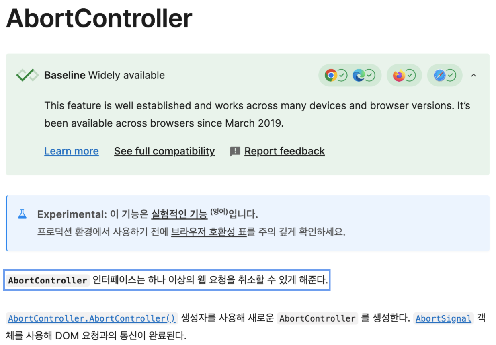

# 콜백과 Promise

콜백은 함수를 인자로 전달하는 전통적인 방식
Promise는 비동기 상태를 객체로 관리

**그런데 비동기란 뭘까?**
비동기는 코드의 실행이 순차적으로 진행되지 않고,
작업이 완료되는 것을 기다리지 않고 다음 작업을 수행하는 방식을 의미
"동시에 여러 작업을 처리하거나, 기다리는 시간을 효율적으로 활용"하는 것이 핵심
예: 백엔드에 API 요청을 보내고, 응답 올 때까지 아무런 프로세스를 진행한다면?
백엔드 요청을 동기적으로 기다리는 순간 서비스 퍼포먼스는 기하급수적으로 떨어짐

### 콜백

함수의 인자로 전달되는 함수로, 비동기 작업 완료 후 실행

```javascript
function fetchDta(callback) {
  setTimeout(() => {
    callback("데이터 로드 완료");
  }, 1000);
}

fetchData((result) => {
  console.log(result); // 1초 후 "데이터 로드 완료" 출력
});
```

단점: 콜백 지옥

```javascript
fs.readFile("file1.txt", (err, data1) => {
  if (err) throw err;
  fs.readFile("file2.txt", (err, data2) => {
    if (err) throw err;
    fs.readFile("output.txt", data1 + data2, (err) => {
      if (err) throw err;
      console.log("작업 완료!");
    });
  });
});
```

Promise가 나오기 전에는 진짜 코드가 이래야 했음

### Promise의 탄생

ES6 표준에서 Promise가 도입(2015년)

**Promise의 정의**

1. 비동기 작업의 최종 완료/실패를 나타내는 객체
2. then()으로 성공, catch()로 실패를 처리
3. 세 개의 상태 중 하나를 가짐
   a. 대기(Pending): 작업이 아직 수행되기 전
   b. 이행(Fulfilled): 작업 성공
   c. 거부(rejected): 작업 실패
   연쇄적인 콜백 지옥을 .then() 메서드 체이닝 방식으로 사용해 가독성을 향상

```javascript
fetchData()
  .then((data) => processData(data)) // 다음 then으로 결과 전달
  .then((result) => saveData(result))
  .catch((error) => console.error(error)); // 모든 에러 한 번에 처리
```

## Promise의 비동기 제어 패턴

### 병렬 처리: Promise.all(ES6, ES2015)

```javascript
Promise.all([fetchData1(), fetchData2()]).then(([result1, result2]) => {
  console.log(result1, result2); // 모든 작업 완료 후 실행
});
```

보통 프론트에서 여러 이미지를 업로드 하는 작업 등에 많이 사용됨
하지만 이 중에서 하나만 예외가 발생해도 모두 하나의 에러 처리가 적용되기 때문에
단순화해서 작업하는데는 낭비가 발생할 수 있음

### Promise.allSettled(ES2020)

모든 프로미스가 완료될 때까지 기다렸다가 각 프로미스의 결과(성공 또는 실패)를 배열로 반환
Promise.all보다는 이걸 사용하는게 더 정교하게 비동기 관리를 할 수 있음

```javascript
const promises = [
  Promise.resolve("성공"),
  Promise.reject("실패"),
  Promise.resolve("또 다른 성공"),
];

Promise.allSettled(promises).then((results) => {
  results.forEach((result) => {
    if (result.status === "fulfilled") {
      console.log("성공:", result.value);
    } else {
      console.log("실패:", result.reason);
    }
  });
});
```

### Promise.any(ES2021)

주어진 프로미스 중 하나라도 성공하면 즉시 반환 (모두 실패할 때만 reject)
뭐라도 하나만 성공하면 되는 상황에서 사용

```javascript
const promises = [
  Promise.reject("에러1"),
  Promise.resolve("첫 번째 성공"),
  Promise.resolve("두 번째 성공"),
];

Promise.any(promises)
  .then((result) => console.log(result)) // "첫 번째 성공" 출력
  .catch((error) => console.error(error.errors)); // 모두 실패한 경우만 실행
```

다양한 시도를 통해 하나만 실행되면 되는 시나리오에서 사용

1. 다중 CDN 주소에 대해 리소스 호출
2. 사용자 위치 정보 획득
   a. 브라우저의 Geolocation API
   b. IP 기반 위치
   c. 사용자 설정 위치
3. 실시간 데이터 소스 연결
   a. 웹소켓
   b. SSE(Server-Send Events)
   c. HTTP 폴링
   Promise.any는 경우에 따라서 Promise.race로 대체해서 사용하는게 더 나은 경우가
   많음. 또한 작동 방식이 앞선 요청이 완료됐더라도 이후 요청이 계속 유지되므로 불필요한
   요청 중단을 처리해줘야 함. 이때 AbortController를 통해 중단하는게 좋음

### Promise.withResolvers (ECMAScript2024)

```javascript
const { promise, resolve, reject } = Promise.withResolvers();

// 나중에 resolve/reject 호출 가능
setTimeout(() => resolve("완료!"), 1000);

promise.then((result) => console.log(result));
```

- 외부에서 resolve/reject를 제어해야 할 때 유용
- 기존 new Promise() 패턴의 대안

### p-limit을 통한 순차적 실행

```javascript
import pLimit from "p-limit";

const limit = pLimit(1);

const input = [
  limit(() => fetchSomething("foo")),
  limit(() => fetchSomething("bar")),
  limit(() => doSomething()),
];

// Only one promise is run at once
const result = await Promise.all(input);
console.log(result);
```

pLimit()에 넣은 인자만큼 한 번에 처리할 프로미스 개수를 한정하여,
프로미스의 순차적 처리가 필요한 경우 사용할 수 있음

**싱글턴 패턴이 적용된 p-limit**

```javascript
import pLimit from 'p-limit';

class LimiterSingleton {
    private static instance: LimiterSingleton;
    private limit: ReturnType<typeof pLimit>;

    private constructor() {
        this.limit = pLimit(1); // 동시에 1개만 실행
    }

    public static getInstance(): LimiterSingleton{
        if(!LimiterSingleton.instance){
            LimiterSingleton.instance = new LimiterSingleton();
        }
        return LimiterSingleton.instance;
    }

    public run<T>(fn: ()=>Promise<T>): Promise<T>{
        return this.limit(fn);
    }
}

export default LimiterSingleton;
```

**팩토리 패턴이 적용된 p-limit**

```javascript
import { fetchSomething } from "./utils";
import { LimiterFactory } from "./LimiterFactory";

const fastLimiter = LimiterFactory.createLimiter(5);
const slowLimiter = LimiterFactory.createLimiter(1);

async function main() {
  await Promise.all([
    fastLimiter.run(() => fetchSomething("fast-1")),
    slowLimiter.run(() => fetchSomething("slow-1")),
  ]);
}
```

### 경쟁 처리: Promise.race(ES6, ES2015)

```javascript
Promise.race([fetchFastAPI(), fetchSlowAPI()]).then((firstResult) => {
  console.log(firstResult); // 가장 빠른 결과만 반환
});
```

주의: Promise.race()는 가장 먼저 settled된 프로미스의 결과만 반환하고, 나머지 프로미스는 취소되지 않고
백그라운드에서 계속 실행됨. 결과를 무시할 뿐이고, API요청이라면 서버에는 요청이 그대로 전달되고 완료되며,
진짜 취소가 필요하다면 AbortController를 함께 사용해야 함

**질문: 만약 race에서 첫번째 요청은 완료됐으나 이어서 진행되는 요청에서 에러가 발생했다면 catch가 발생하나?**
정답:

- 동작: 이미 첫 번째 프로미스가 완료(성공 또는 실패)된 후에는 나머지 프로미스에서 발생하는 에러는 무시됨
- 이유: Promise.race는 첫 번째로 settled된 프로미스의 결과만을 처리하며, 나머지 프로미스의 결과는 관심 대상이 아님

```javascript
const p1 = new Promise((resolve) => setTimeout(() => resolve("성공1"), 100));
const p2 = new Promise((_, reject) =>
  setTimeout(() => reject(new Error("실패1")), 200),
);

Promise.race([p1, p2])
  .then((result) => console.log("결과:", result)) // "결과: 성공1" 출력
  .catch((error) => console.error("에러:", error)); // 실행되지 않음
```

**질문: 만약 하나도 완료되기 전에 특정 요청이 에러를 반환하면 나머지 진행중인 요청은 계속 진행되는가?**
정답:

- 동작: 어떤 프로미스가 가장 먼주 거부(reject)되면, Promise.race는 즉시 그 에러를 반환함
- 이유: 거부도 "완료(settled)"의 한 형태이기 때문에, 가장 먼저 거부된 프로미스가 Promise.race의 결과를 결정

```javascript
const p1 = new Promise((resolve) => setTimeout(() => resolve("성공1"), 200));
const p2 = new Promise((_, reject) =>
  setTimeout(() => reject(new Error("실패1")), 100),
);

Promise.race([p1, p2])
  .then((result) => console.log("결과:", result)) // 실행되지 않음
  .catch((error) => console.error("에러:", error)); // "에러: Error: 실패1" 출력
// p2가 먼저 거부되어 그 에러가 catch로 전달됨
```

**Promise.race의 대표적인 예시**

```javascript
function fetchWithTimeout(url, options = {}, timeout = 5000) {
  // API 호출 프로미스
  const fetchPromise = fetch(url, options).then((response) => {
    if (!response.ok) {
      throw new Error(`HTTP error! status: ${response.status}`);
    }
    return response.json();
  });

  // 타임아웃 프로미스
  const timeoutPromise = new Promise((_, reject) => {
    setTimeout(() => {
      reject(new Error(`Request timed out after ${timeout}ms`));
    }, timeout);
  });

  // 둘 중 먼저 완료되는 것 사용
  return Promise.race([fetchPromise, timeoutPromise]);
}
```

### AbortController 활용하기

많은 개발자가 모르는 도구 중 하나가 AbortController임
이 컨트롤러의 핵심 목적은 웹 요청을 클라이언트에서 취소하는 것

```javascript
function fetchWithAbortTimeout(url, options = {}, timeout = 5000) {
  const controller = new AbortController();
  const { signal } = controller;

  // API 호출 프로미스
  const fetchPromise = fetch(url, { ...options, signal })
    .then((response) => {
      if (!response.ok) {
        throw new Error(`HTTP error! status: ${response.status}`);
      }
      return response.json();
    })
    .catch((error) => {
      if (error.name === "AbortError") {
        throw new Error(`Request aborted after ${timeout}ms`);
      }
      throw error;
    });

  // 타임아웃 프로미스
  const timeoutPromise = new Promise((_, reject) => {
    setTimeout(() => {
      controller.abort();
      reject(new Error(`Request timed out after ${timeout}ms`));
    }, timeout);
  });

  return Promise.race([fetchPromise, timeoutPromise]);
}
```


호출할 API fetch에 controller에서 반환된 signal을 옵션 페이로드에 담아 전달하는
방식으로 구현할 수 있음

```javascript
var controller = new AbortController();
var signal = controller.signal;

var downloadBtn = document.querySelector(".download");
var abortBtn = document.querySelector(".abort");

downloadBtn.addEventListener("click", fetchVideo);

abortBtn.addEventListener("click", function () {
  controller.abort();
  console.log("Download aborted");
});

function fetchVideo(){
    ...
    fetch(url, {signal}).then(function(response){
        ...
    }).catch(function(e){
        reports.textContent = 'Downlad error: ' + e.message;
    })
}
```
