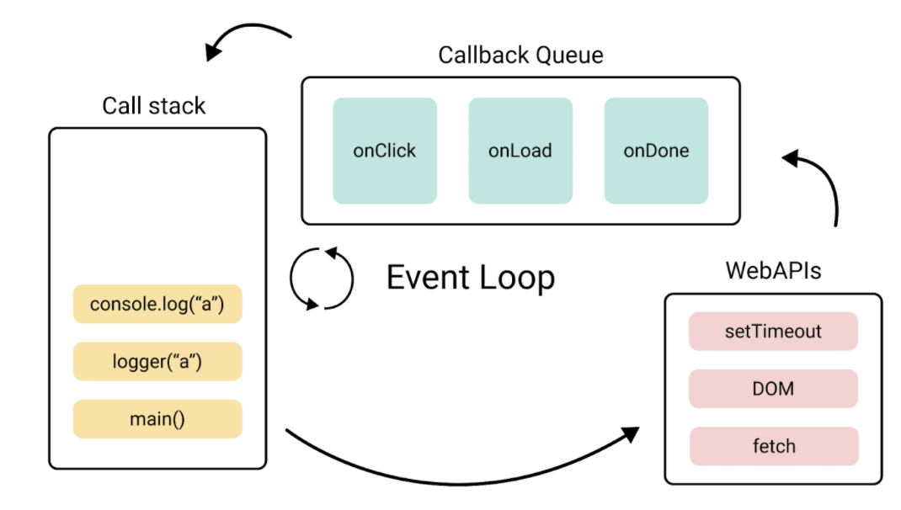

# 이벤트 루프

단일 스레드 기반으로 동작하지만, 이벤트 루프를 통해 비동기 처리와 논블로킹 I/O를 가능하게 함
이벤트 루프 안에 들어간 것이 앞서 배운 콜스택, 힙 그리고 태스크 큐, 마이크로태스크 큐이며
브라우저의 경우에는 렌더링 파이프라인이 포함됨

**태스크 큐(Macrotask Queue)**

- setTimeout, setInterval, DOM 이벤트, I/O 등의 콜백이 대기
- 매크로태스크라고도 부름

**마이크로태스크 큐(Microtask Queue)**

- Promise, queueMicrotask, MutationObserver 콜백이 대기
- 매크로테스크큐보다 우선순위가 높음

**렌더링 파이프라인(브라우저 한정)**

- CSS 계산 -> 레이아웃 -> 페인팅 작업이 마이크로태스크 이후, 매크로태스크 이전에 실행

### 이벤트 루프의 순서

- 호출 스택이 비어있는지 확인
  - 스택이 비어 있으면 다음 단계 진행
- 마이크로태스크 큐 처리
  - 큐에 있는 모든 마이크로태스크를 순차적으로 실행
  - 예: Promise.then(), await의 후속 처리
- 렌더링(브라우저)
  - UI 업데이트가 필요한 경우 실행
- 매크로태스크 큐 처리
  - 한 개의 매크로태스크만 실행 후 다시 이벤트 루프 시작
  - 예: setTimeout, 클릭 이벤트

```javascript
console.log("Start"); // 1. 동기 코드

setTimeout(() => console.log("Timeout"), 0); // 5. 매크로태스크

Promise.resolve()
  .then(() => console.log("Promise1")) // 3. 마이크로태스크
  .then(() => console.log("Promise2")); // 4. 마이크로태스크

console.log("End"); // 2. 동기 코드
```


** 자바스크립트의 호출 순서**
콜스택 -> 마이크로태스크 -> 브라우저 렌더링 -> 매크로태스크
** 이런순서로 한 이유가 뭘까?**

- 콜스택이 제일 먼저인 이유
  - 당연하지만 지금 실행 중인 코드가 끝나야 다음으로 넘어갈 수 있음
- 마이크로태스크가 렌더링보다 먼저인 이유
  - 마이크로태스크가 렌더링 이후에 실행되면 상태 업데이트 전에 화면이 그려짐
  - 그러면 전 값이 보였다가 다시 그려지면서 화면 깜빡임
  - 마이크로태스크를 먼저 처리해서 상태를 확정한 뒤
  - 렌더링에서 한 번에 올바른 값을 그리기 때문일듯
- 렌더링이 매크로태스크보다 먼저인 이유
  - 브라우저는 60fps 기준으로 16.6ms마다 렌더링 기회를 가진다
  - 만약 매크로태스크가 렌더링보다 먼저라면 여러 매크로태스크가 쌓였을 때
  - 렌더링이 계속 밀려 화면이 버벅인다
  - 매크로태스크 하나 처리 후 렌더링 기회를 주는 방식이여서 화면이 부드럽지 않을까?
- 내 생각
  - 콜 스택 -> 지금 할 일 마무리
  - 마이크로태스크 -> 상태 완전히 확정
  - 렌더링 -> 확정된 상태로 화면 한 번에 그리기
  - 매크로태스크 -> 다음 작업 하나 처리
