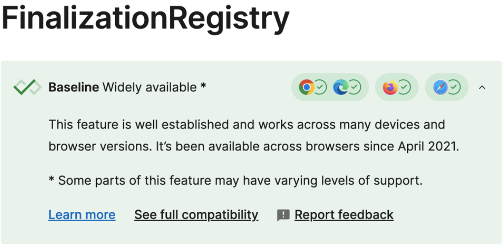

# Map

ES6(ECMAScript 2015)에서 도입된 키-값 쌍을 저장하는 컬렉션 자료형

### 기본 특징

1. 키 타입 다양성: 객체와 달리 모든 타입(객체, 함수, 원시값 등)을 키로 사용 가능
2. 순서 보장: 삽입 순서가 유지됨
3. 크기 추적: size 프로퍼티로 쉽게 요소 개수 확인 가능
4. 전용 메서드: 맵 전용 유용한 메서드 제공
5. 성농: 객체보다 삭제, 추가시 이점이 발생
   기본 특징이 곧 Map을 사용해야 하는 핵심 이유가 됨. 반드시 Map의 강점을
   기억해두어야 실제 개발에서 적극적으로 활용할 수 있음

**왜 Map이 Object보다 추가, 삭제 상황에서 성능이 뛰어날까?**
해시 테이블 기반 구현: Map은 내부적으로 해시 테이블을 사용하여 구현되어 있어
평균적으로 O(1) 시간 복잡도, 물론 객체 O(1)의 시간 복잡도에 준하지만 차이가 있음

### V8엔진에서의 Hidden Class

동적 생성: 객체가 생성될 때마다 해당 객체의 "모양"(프로퍼티 구조)에 따라 Hidden Class가 생성
변경 시 새 클래스 생성: 객체에 새 프로퍼티가 추가되면 새로운 Hidden Class가 생성되고,
기존 객체는 이 새 클래스를 참조하도록 업데이트

**주의사항**

- 동일한 Hidden Class를 공유하는 객체는 더 빠르게 접근 가능
- 프로퍼티 추가 순서가 다르면 다른 Hidden Class가 생성되어 성능 저하
- 동적 프로퍼티 추가/삭제가 빈번하면 Hidden Class 변경이 잦아져 성능 저하

**Dictionary Mode (Slow Properties)**

1. 전환 조건:
   - 프로퍼티가 매우 자주 추가/삭제될 때
   - 프로퍼티 이름이 매우 다양할 때(예: 동적 생성 키)
   - 대량의 프로퍼티가 있을 때
2. 특징:
   - 더 이상 Hidden Class를 사용하지 안혹 해시 테이블 방식으로 전환
   - 유연성은 높지만 접근 속도가 느려짐
   - 메모리 사용량이 증가
3. Map과의 차이:
   - Map은 처음부터 해시 테이블로 설계되어 Dictionary Mode의 오버헤드 없음
   - 객체는 Hidden Class 최적화를 위해 설계되었지만, Dictionary Mode로 전환되면 Map보다 느려질 수 있음

### 기본 용법

```javascript
const map = new Map();

// 값 설정
map.set("name", "Alice");
map.set(42, "The Answer");
map.set({ id: 1 }, "Object Key");

// 값 가져오기
console.log(map.get("name")); // 'Alice'
console.log(map.get(42)); // 'The Answer'

// 크기 확인
console.log(map.size); // 3

// 존재 여부 확인
console.log(map.has("name")); // true

// 값 삭제
map.delete(42);

// 전체 초기화
map.clear();
```

### 반복 메서드

```javascript
const map = new Map([
  ["a", 1],
  ["b", 2],
  ["c", 3],
]);

// 키-값 쌍 순회
for (const [key, value] of map) {
  console.log(key, value);
}

// 키만 순회
for (const key of map.keys()) {
  console.log(key);
}

// 값만 순회
for (const value of map.values()) {
  console.log(value);
}

// forEach 사용
map.forEach((value, key) => {
  console.log(key, value);
});
```

### 초기화 방법

```javascript
// 배열로 초기화
const map = new Map([
  ["key1", "value1"],
  ["key2", "value2"],
]);

// 객체로부터 변환
const obj = { a: 1, b: 2 };
const mapFromObj = new Map(Object.entries(obj));
```

### 사용 사례

1. 키 타입 다양성: 객체와 달리 모든 타입(객체, 함수, 원시값 등)을 키로 사용 가능
2. 순서 보장: 삽입 순서가 유지됨
3. 크기 추적: size 프로퍼티로 쉽게 요소 개수 확인 가능
4. 전용 메서드: 맵 전용 유용한 메서드 제공
   앞서 이야기한 기본 목적에 맞게 사용하는게 정석에 해당. 키가 다양한
   상황에 대응해 하나의 컬렉션으로 저장되서 관리되는게 좋은 경우, 입력 순서가
   보장되어야 하는 경우, 크기 산출이 필요한 경우, 기타 Map의 메서드와 특성을
   활용하면 좋은 경우(특히 특정 알고리즘 패턴)에 사용

### 함수 결과 캐싱

```javascript
const fibCache = new Map();

function fibonacci(n) {
  // 기본 케이스
  if (n <= 1) return n;

  // 캐시 확인
  if (fibCache.has(n)) {
    return fibCache.get(n);
  }

  // 재귀 계산
  const result = fibonacci(n - 1) + fibonacci(n - 2);

  // 결과 캐싱
  fibCache.set(n, result);

  return result;
}
```

### 사이즈 추적 & 동적 폼 필드 관리

```javascript
function DynamicForm() {
  const [fields, setFields] = useState(
    new Map([
      ["username", ""],
      ["email", ""],
    ]),
  );

  const handleChange = (fieldName, value) => {
    // Map의 set 메서드로 업데이트
    const newFields = new Map(fields).set(fieldName, value);
    setFields(newFields);
  };

  const addField = () => {
    const newFieldName = `field-${fields.size + 1}`; // size 프로퍼티 활용
    setFields(new Map(fields).set(newFieldName, ""));
  };

  return (
    <div>
      {/* Map의 entries() 메서드로 렌더링 */}
      {Array.from(fields.entries()).map(([name, value]) => (
        <input
          key={name}
          name={name}
          value={value}
          onChange={(e) => handleChange(name, e.target.value)}
        />
      ))}
      <button onClick={addField}>Add Field ({fields.size} fields)</button>
    </div>
  );
}
```

### 순서 보장이 중요한 케이스 - 드래그 가능한 리스트(@hello-pangea/dnd를 활용)

```tsx
import { useState } from "react";
import {
  DragDropContext,
  Droppable,
  Draggable,
  DropResult,
} from "@hello-pangea/dnd";

function DraggableList() {
  const [items, setItems] = useState(
    new Map([
      [1, { id: 1, text: "First" }],
      [2, { id: 2, text: "Second" }],
      [3, { id: 3, text: "Third" }],
    ]),
  );

  const handleDragEnd = (result: DropResult) => {
    if (!result.destination) return;

    const newItems = new Map();
    // 삽입 순서 유지를 위해 배열로 변환 후 재구성
    const itemsArray = Array.from(items.entries());

    // 드래그 아이템 제거
    const [removed] = itemsArray.splice(result.source.index, 1);
    // 새로운 위치에 삽입
    itemsArray.splice(result.destination.index, 0, removed);

    // 순서 유지하며 새 Map 생성
    itemsArray.forEach(([id, item]) => {
      newItems.set(id, item);
    });

    setItems(newItems);
  };

  return (
    <DragDropContext onDragEnd={handleDragEnd}>
      <Droppable droppableId="items">
        {(provided) => (
          <div {...provided.droppableProps} ref={provided.innerRef}>
            {Array.from(items.entries()).map(([id, item], index) => (
              <Draggable key={id} draggableId={String(id)} index={index}>
                {(provided) => (
                  <div
                    ref={provided.innerRef}
                    {...provided.draggableProps}
                    {...provided.dragHandleProps}
                  >
                    {item.text}
                  </div>
                )}
              </Draggable>
            ))}
            {provided.placeHolder}
          </div>
        )}
      </Droppable>
    </DragDropContext>
  );
}

export default DraggableList;
```

# WeakMap

**기본 특징**

1. 키(key)로만 약한 참조(Weak Reference)를 갖는 Map.
2. 키가 GC 대상이 되면, 해당 엔트리도 자동 삭제
3. Map과 달리 **키는 반드시 객체**

**힙 메모리 누수 문제와 WeakMap을 통한 해결책**
힙 메모리 누수는 JavaScript에서 더 이상 사용되지 않는 객체가
가비지 컬렉션되지 않고 메모리를 계속 차지하는 현상

### 캐시 시스템에서 메모리 누수 방지

```javascript
const cache = new WeakMap(); // 키가 GC되면 값도 자동 제거

function getHeavyData(obj) {
  if (!cache.has(obj)) {
    const result = heavyCalculation(obj);
    cache.set(obj, result); // obj가 살아있는 동안만 캐시 유지
  }
  return cache.get(obj);
}
```

1. 일반 Map을 사용하면 obj가 사라져도 cache에서 제거되지 않아 누수 발생
2. WeakMap을 사용하면 obj가 GC되면 캐시도 자동 정리됨
   **예시**

```javascript
// Map의 문제
const cache = new Map();

let user = { name: "jun" };
cache.set(user, "무거운 계산 결과");

user = null;
// 나는 user 다 썼으니까 지우려고 null했지만
// cache가 아직 {name:'jun'}을 키로 붙잡고 있음
// GC가 지우고 싶어도 못지움 -> 메모리 누수

// WeakMap은 약하게 잡고있음
const cache2 = new WeakMap();

let user2 = { name: "jun" };
cache2.set(user2, "무거운 계산 결과");

user2 = null;
// WeakMap은 약한 참조라 GC막지않음
```

### DOM 요소와 메타데이터 연결 시

```javascript
const domMetadata = new WeakMap(); // DOM이 제거되면 메타데이터도 삭제

const element = document.getElementById("my-element");
domMetadata.set(element, { clicks: 0 });

element.addEventListener("click", () => {
  const meta = domMetadata.get(element);
  meta.clicks++;
});
// element가 DOM에서 제거되면, domMetadata의 엔트리도 자동 삭제됨
```

### WeakMap 한계와 대안

1. 키만 약한 참조 -> 값은 GC 대상이 아님.
   값이 큰 데이터라면, 키가 사라져도 값은 메모리에 남을 수 있음
2. 순회 불가능 -> 캐시 전체를 조회할 수 없음

**대안: WeakRef + FinalizationRegistry(ES2021)**

```javascript
const registry = new FinalizationRegistry((heldValue) => {
  console.log(`${heldValue}가 GC되었습니다`);
});

const obj = { data: "Large Object" };
registry.register(obj, "obj"); // obj가 GC되면 콜백 실행

const weakRef = new WeakRef(obj); // 약한 참조 생성
```

- WeakRef: 객체에 대한 약한 참조 생성
- FinalizationRegistry: 객체가 GC될때 콜백 실행(GC 클린업 콜백 함수)

### FinalizationRegistry는 뭔가요?

FinalizationRegistry는 JavaScript의 기능으로,
객체가 가비지 컬렉션될 때 콜백 함수를 실행할 수 있게 해줌
ES2021(ES12)에 도입되었으며, 메모리 관리와 관련된 고급 시나리오에서 활용됨


### FinalizationRegistry 기본 개념

- 역할

1. 객체가 GC되면 등록된 콜백을 호출
2. 주로 리소스 정리 (예: 파일 핸들, 네트워크 연결 해제)에 사용

- 작동 조건

1. 객체에 더 이상 강한 참조가 없어야 함
2. GC 실행 시점은 JavaScript 엔진에 의존적이므로 즉시 실행되지 않을 수 있음

### FinalizationRegistry 사용 방법

```javascript
// 레지스트리 생성
const registry = new FinalizationRegistry((heldValue) => {
  console.log(`${heldValue}가 GC되었습니다`);
});

// 객체 등록
const obj = { data: "Large Object" };
registry.register(obj, "obj의 설명");
// registry.register(등록대상, 콜백에 넘길값, 취소할때 쓸 식별자)

// 등록 취소 (선택 사항)
registry.unregister(token); // 등록 시 사용한 토큰으로 취소
```

### 실제 예제: 파일 핸들러 정리

시나리오: 파일을 열고 사용 후 자동으로 리소스를 해제하려 할 때

```javascript
const fs = require("fs");
const fileRegistry = new FinalizationRegistry((filePath) => {
  console.log(`파일 ${filePath} 핸들러가 GC되었습니다. 리소스 정리`);
  try {
    fs.closeSync(filePath);
  } catch (error) {
    console.error(`파일 ${filePath} 닫기 실패: `, error.message);
  }
});

async function openFile(path) {
  try {
    const fileHandle = await fs.promises.open(path, "r");
    fileRegistry.register(fileHandle, path);
    return fileHandle;
  } catch (error) {
    console.error(`파일 ${path} 열기 실패: `, error.message);
    throw error;
  }
}

// 사용 예시
async function main() {
  try {
    let handle = await openFile("example.txt");
    // 파일 작업 수행
    const content = await handle.readFile();
    console.log("파일 내용: ", content.toString());
  } catch (error) {
    console.error("에러 발생: ", error.message);
  }
}

main();
```

### 실제 예제: WeakRef와 함께 사용

WeakRef로 약한 참조 생성하고 registry를 연결한 패턴
아래와 같이 진행하면 일반적으로 로그가 나타나지 않음

```javascript
const registry = new FinalizationRegistry((heldValue) => {
  console.log(`객체 ${heldValue} 제거됨`);
});

let obj = { key: "value" };
const ref = new WeakRef(obj);

registry.register(obj, "obj 참조");
obj = null; // 강한 참조 제거
```

**코드에서 FinalizationRegistry가 제대로 작동하지 않는 것처럼 보이는 이유**
가비지 컬렉션이 즉시 실행되지 않기 때문. 가비지 컬렉션은 비결
(non-deterministic)이며, 메모리 부족 상황이 발생할 때만 실행

### 그런데 WeakRef는 뭔가요?

- WeakRef(ES2021)
  역할: 객체에 대한 약한 참조(Weak Reference) 생성
- FinalizationRegistry와의 차이점:
  WeakRef는 객체의 생존 여부만 추적
  FinalizationRegistry는 GC시 콜백 실행

```javascript
let obj = { data: "test" };
const weakRef = new WeakRef(obj);
console.log(weakRef.deref()); // 객체 접근 ({data:"test"})
obj = null; // GC 후 weakRef.deref()는 undefined 반환

console.log(weakRef.deref()); // ???
```

obj = null로 바뀌었지만 바로 console.log를 해볼 경우에는
기존값이 그대로 유지되는 걸 볼 수 있음
이는 아직 GC가 이뤄지지 않았기 때문임
