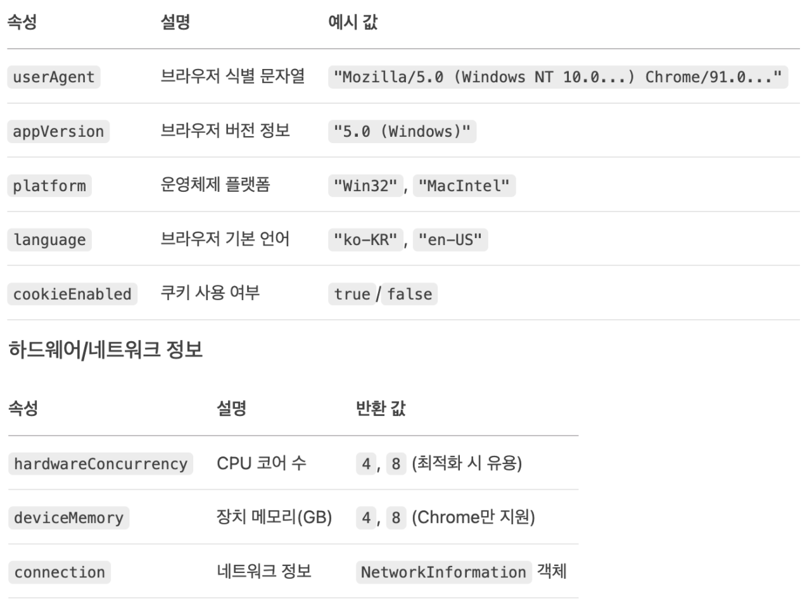
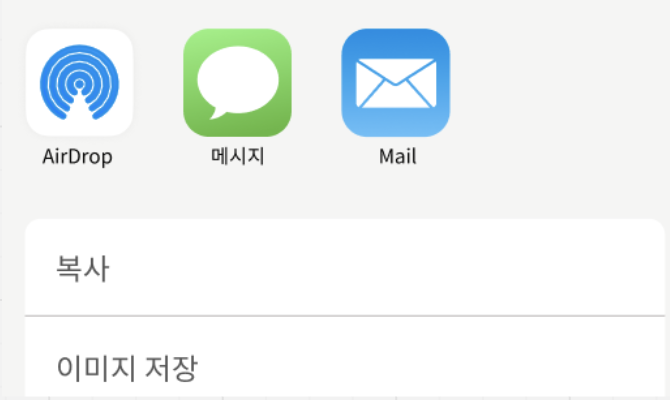
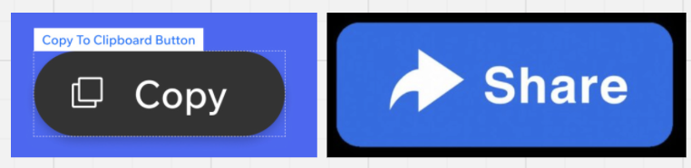
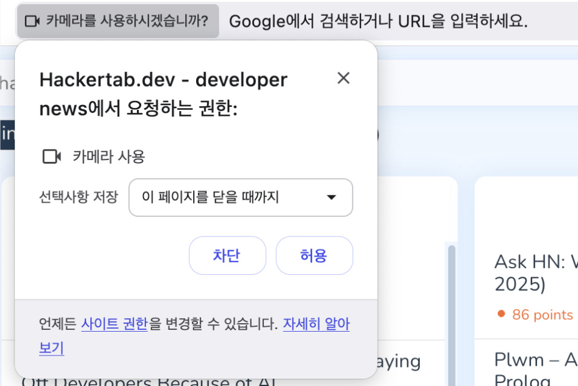
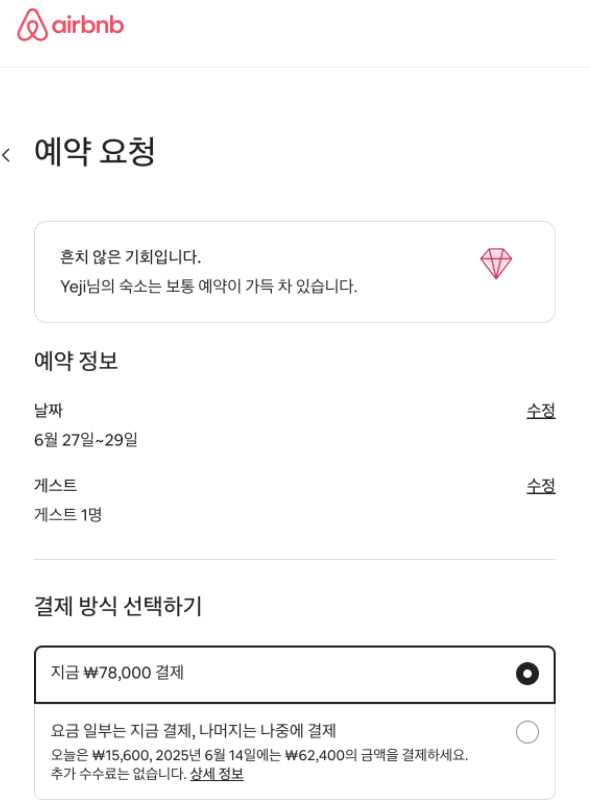

# Web API

웹 브라우저에서 제공되는 기본 기능들로 별도의 선언이나 참조 없이 전역에서 접근 가능

"왜 Fetch를 리액트에서 참조 없이 사용 가능할까?"

- Fetch가 Web API이기 때문

## 대표적인 Web API

### Fetch

- 용도: 서버와 HTTP통신 (REST API 호출)

```javascript
fetch("https://api.example.com/data")
  .then((response) => response.json())
  .then((data) => console.log(data));
```

### LocalStorage/SessionStorage

- 용도: 클라이언트 측 데이터 저장

```javascript
localStorage.setItem("user", JSON.stringify(userData));
const user = JSON.parse(localStorage.getItem("user"));
```

### Intersection Observer API

- 용도: 요소 가시성 관찰(무한 스크롤, 레이지 로딩)
- 예: 구글 애드센스(광고가 실제로 사용자에게 보였는지 모니터링)

```javascript
const observer = new IntersectionObserver((entries) => {
  entries.forEach((entry) => {
    if (entry.isIntersecting) {
      loadContent();
    }
  });
});
observer.observe(document.querySelector(".footer"));
```

### Web Workers

- 용도: 메인 스레드 블로킹 방지 (무거운 계산 작업)

```javascript
const worker = new Worker("worker.js");
worker.postMessage(data);
worker.onmessage = (e) => console.log(e.data);
```

### Geolocation API

- 용도: 사용자 위치 정보 획득

```javascript
navigator.geolocation.getCurrentPosition(
  (position) => console.log(position.coords),
  (error) => console.error(error),
);
```

### Canvas API

- 용도: 동적 그래픽 생성 및 조작

```javascript
const ctx = canvas.getContext("2d");
ctx.fillStyle = "red";
ctx.fillRect(10, 10, 100, 100);
```

### WebSocket API

- 용도: 실시간 양방향 통신

```javascript
const socket = new WebSocket("wss://echo.websocket.org");
socket.onmessage = (e) => console.log(e.data);
socket.send("Hello!");
```

### Clipboard API

- 용도: 클립보드 작업

```javascript
navigator.clipboard
  .writeText("복사할 테스트")
  .then(() => console.log("복사 성공"));
```

최신 기능으로는 클립보드에 이미지 복사도 가능

```javascript
// 이미지 복사 (최신 브라우저)
const blob = await fetch("image.png").then((r) => r.blob());
await navigator.clipboard.write([new ClipboardItem({ "image/png": blob })]);
```

## 중요: navigator 객체

navigator 객체는 웹 브라우저의 정보와 기능에 접근할 수 있는 Web API
사용자의 브라우저 종류, 운영체제, 네트워크 상태 등 환경 정보 제공
전역 객체로 존재하므로 별도의 선언 없이 바로 사용 가능


**기능 지원 여부 판단 예시**

```javascript
// 서비스 워커 지원 여부
if ("serviceWorker" in navigator) {
  navigator.serviceWorker.register("/sw.js");
}

// 웹 공유 기능 지원 여부
if (navigator.share) {
  navigator.share({ title: "공유 예제", url: "..." });
}
```

### 중요: navigator.share 기능

보통 웹 개발시에 링크 공유에는 Clipboard API를 이용해 클립보드에 복사하는 정도로 구현되지만
웹 공유 자체 기능을 사용하면 네이티브 친화적인 공유가 가능해짐

프론트 개발시에는 사용자의 기기에 주소를 복사하는 정도의 기능으로 제공되는 클립보드 복사와
콘텐츠를 직접적으로 공유할 수 있는 navigator.share를 병행하여 UI로 분리해서 제공해주는게 가장 좋음


### 배터리 상태 조회(스마트폰 환경)

```javascript
navigator.getBattery().then((battery) => {
  console.log(`배터리 레벨: ${battery.level * 100}%`);
  battery.addEventListener("levelchange", updateBatteryUI);
});
```

navigator 객체의 각 기능은 브라우저 실행 환경에 따라 사용 가능한 기능에 차이가
있음. 그러므로 사용 전에 기능이 존재하는지 판단 후 호출하는게 안전함
또한 기능이 없을 경우에는 예외 처리가 꼭 필요함

### navigator.mediaDevices 기능

```javascript
// 카메라 접근
navigator.mediaDevices
  .getUserMedia({ video: true })
  .then((stream) => {
    videoElement.srcObject = stream;
  })
  .catch((err) => {
    console.error("미디어 장치 오류:", err);
  });
```


**중요:브라우저 호환성 이슈 대처법**

```javascript
// 기능 감지 패턴
function checkFeature(feature) {
  return feature in navigator;
}

// 사용 예시
if (checkFeature("geolocation")) {
  // 위치 서비스 사용
} else {
  alert("이 브라우저는 위치 서비스를 지원하지 않습니다.");
}

// 폴백 구현 예제 (Geolocation)
function getLocation() {
  if (navigator.geolocation) {
    // 표준 API 사용
  } else {
    // IP 기반 위치 조회 폴백
    fetch("https://ipapi.co/json/").then((response) => response.json());
  }
}
```

사용자의 위치나 카메라, 클립보드 기능 등은 모두 권한을 받아야 하기 때문에
해당 권한이 제대로 승인 되었는지 확인 후 사용되도록 코드가 작성되어야 함

```javascript
// 권한 상태 확인
navigator.permissions
  .query({ name: "geolocation" })
  .then((status) => console.log(status.state));
```

## Local Storage

브라우저에 데이터를 유지해야 하는 상황일 때 가장 많이 사용되는 저장소
세션 스토리지는 탭이 닫히면 사라지기 때문에 비교적 덜 사용되는 반면,
로컬 스토리지는 브라우저가 닫혀도 유지되기 때문에 널리 사용됨.

### 전역 커스텀 훅을 통한 로컬스토리지 예시

```javascript
import { useState, useEffect } from "react";

function useLocalStorage(key, initialValue) {
  const [storedValue, setStoredValue] = useState(() => {
    try {
      const item = window.localStorage.getItem(key);
      return item ? JSON.parse(item) : initialValue;
    } catch (error) {
      console.error(error);
      return initialValue;
    }
  });

  const setValue = (value) => {
    try {
      const valueToStore =
        value instanceof Function ? value(storedValue) : value;
      setStoredValue(valueToStore);
      window.localStorage.setItem(key, JSON.stringify(valueToStore));
    } catch (error) {
      console.error(error);
    }
  };

  return [storedValue, setValue];
}
```

브라우저에서는 window를 통해 접근해야 하므로
typeof window !=='undefined'로 많이 판별

```javascript
function useLocalStorage(key, initialValue) {
  const [storedValue, setStoredValue] = useState(initialValue);

  useEffect(() => {
    try {
      if (typeof window !== "undefined") {
        const item = window.localStorage.getItem(key);
        setStoredValue(item ? JSON.parse(item) : initialValue);
      }
    } catch (error) {
      console.error(error);
    }
  }, [key, initialValue]);
}
```

로컬 스토리지 사용시에는 데이터를 serialize/deserialize 하여 사용

```javascript
// Storing
localStorage.setItem("key", JSON.stringify(data));

// Retrieving
const data = JSON.parse(localStorage.getItem("key"));
```

로컬 스토리지 사용시에 에러는 크게 접근 에러와 한계 용량
에러(QuotaExceededError) 2가지가 발생하므로 이에 대해 에러 캐칭을
잡아주는게 좋음

```javascript
try {
  localStorage.setItem("key", data);
} catch (e) {
  if (e instanceof DOMException && e.name === "QuotaExceededError") {
    // Handle storage full error
    console.error("LocalStorage is full");
  } else {
    // Handle other errors
    console.error("Error accessing LocalStorage", e);
  }
}
```

보통은 클린업 시나리오를 포함해 로컬 스토리지를 영구적으로 보관하지 않도록
관리해주는게 좋음

## Session Storage

세션 스토리지는 목적에 따라 사용한다면 매우 강력하게 사용될 수 있어서
몇가지 대표 아이디어는 기억해두는게 좋음

### 폼 데이터 임시 저장

```javascript
// 폼 입력 시 저장
form.addEventListener("input", (e) => {
  sessionStorage.setItem("formData", JSON.stringify(formData));
});

// 페이지 로드 시 복구
window.addEventListener("load", () => {
  const savedData = sessionStorage.getItem("formData");
  if (savedData) {
    populateForm(JSON.parse(savedData));
  }
});
```

### 사용자 진행 상태 추적

```javascript
// 다음 단계로 이동 시
sessionStorage.setItem("currentStep", "step3");

// 페이지 재방문 시
const currentStep = sessionStorage.getItem("currentStep") || "step1";
showStep(currentStep);
```

사용자가 폼을 순서대로 입력하는 페이지가 있을 때, 1개 이상의 폼을 서비스에서
동시에 입력 가능한 경우 전역 상태 관리를 쓰지 않고 세션 스토리지를 쓰는게 오히려
멀티 탭 환경에 대응하기에 더 좋음
예: 항공권, 티켓팅 사이트 등

대표적으로 이러한 결제 프로세스 페이지를 일괄 라우트로 지정하고, 전역 상태 관리를
통해서 관리하게 되면 취약점 발생.
이러한 이유로 세션 스토리지 + URL 쿼리 스트링을 조합해 탭과 사용자의 요청 페이지의
정보를 온전히 분리해서 그것에 대응되는 데이터가 전달되도록 설정

### 멀티탭 환경에서의 관리

```javascript
// 탭별로 독립적인 작업 진행 가능
const tabId = Math.random().toString(36).substring(2);
sessionStorage.setItem("currentTabId", tabId);
```

현재는 전역 상태 관리나 useState 등의 컴포넌트 수준 상태 관리가 많이 사용되다 보니
세션 스토리지는 멀티탭 상황에 대응하는 아주 좋은 방법이 됨

### 페이지 전환 간 데이터 전달

```javascript
// 페이지 이동 전
sessionStorage.setItem(
  "tempData",
  JSON.stringify({ from: "pageA", data: someData }),
);

// 대상 페이지에서
const tempData = JSON.parse(sessionStorage.getItem("tempData"));
sessionStorage.removeItem("tempData");
```

### 임시 대용량 데이터 저장

```javascript
// 대용량 리포트 데이터 임시 저장
function generateReport(data) {
  sessionStorage.setItem("reportData", JSON.stringify(processData(data)));
  window.open("/report-viewer");
}
```

세션스토리지는 탭 간 공유가 불가능한데 새탭을 열면 데이터가 없을텐데
예시가 부족하거나 잘못된듯?

### 보편적으로 사용될 수 있는 세션 스토리지 전역 커스텀 훅

```javascript
import { useState, useEffect } from "react";

function useSessionStorage(key, initialValue) {
  const [value, setValue] = useState(() => {
    const storedValue =
      typeof window !== "undefined" ? window.sessionStorage.getItem(key) : null;
    return storedValue ? JSON.parse(storedValue) : initialValue;
  });

  useEffect(() => {
    window.sessionStorage.setItem(key, JSON.stringify(value));
  }, [key, value]);

  return [value, setValue];
}

// 사용 예시
function CheckoutProcess() {
  const [shippingInfo, setShippingInfo] = useSessionStorage("shipping", {});
  // ...
}
```

### 세션 스토리지의 보편적 사용 목적

- 일시적인 데이터 저장이 필요할 때
- 사용자 세션 동안만 유지되어야 할 정보
- 민감하지 않지만 탭별로 독립적인 데이터
- 사용자가 브라우저를 닫으면 자동으로 삭제되어야 하는 데이터
